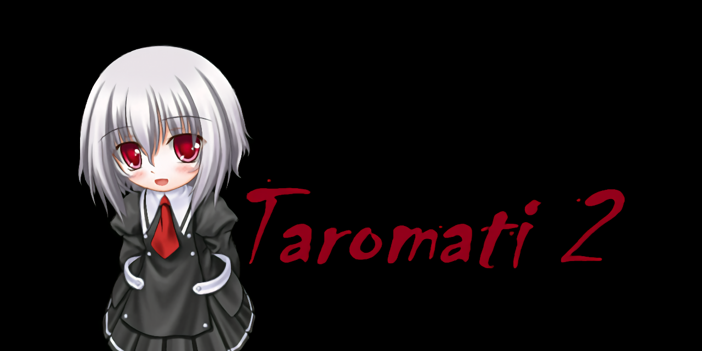

本项目支持anti-996，请所有国产浏览器拉黑并禁止访问，谢谢  
### 公告  
> Taromati2的开发告一段落  
> 某些功能虽然想加，但无奈aya并不是好的适合完成我希冀功能的语言  
> （尽管并不是完全实现不了）  
> 而某些bug无法修复或功能难以开发也是因为ssp或aya本身的限制  
> 目前来说我会以ELC更新为主  
> 待我写完ELC后将用ELC重写Taromati2，可能的话也会另写ssp  
> 近期对Taromati2的维护将以bug修复、台词优化为主  
> 在help wanted的部分若是有人完成我也会尽快整合  
> 毕竟我是个普通学生所以请谅解我时间不够这件事  
> 毕竟除了上没什么营养的课以外还想要锻炼、看书、做手工、练各种技能、写ELC、打warframe和arcaea之类。。。。  
> 真的很忙真的没空  
> 如果可以的话可以去[爱发电]( https://afdian.net/@steve02081504 )支持我一下，我会很开心  
> 以上  
> steve02081504写于2020-10-10  

### 绍介  
Taromati2  
  
这是一款私人配布的伪春菜人格，包含角色kikka与towa  
原作者是'[8]( http://unvollendet.web.fc2.com/ )'，此配布属于在他人再创作基础上的再创作  
中间经历过无数人之手  
  
### 如何快速上手  
对于伪春菜使用者，[点击这里下载轻型nar]( https://github.com/Taromati2/Taromati2/releases/download/ghost/Taromati2.7z )  
对于第一次接触伪春菜的人，[点击这里下载初心者包]( https://github.com/Taromati2/Taromati2/releases/download/ghost/StarterPack.7z )  
  
注意：下载下来后需要在线更新，如果你网不好请参阅[初次启动更新]( ./docs/points_for_attention.md#%E4%B8%80%E5%88%9D%E6%AC%A1%E5%90%AF%E5%8A%A8%E6%9B%B4%E6%96%B0 )  
使用方法：  
对于初心者，在解压并运行了ssp后，你可以看到你的ssp自带人格ssper  
这时将初心者包中的nar拖给它，它便会自动帮你安装Taromati2  
随后你需要右键ssper，将人格切换为Taromati2  
便可以开始使用了  

### [注意事项]( ./docs/points_for_attention.md )  
请点击上方标题  

### bug反馈  
[提交issues]( https://github.com/Taromati2/Taromati2/issues/new?assignees=steve02081504&labels=bug&template=bug-report.md&title=a+bug )  
若您不会，请按[此页面]( https://steve02081504.github.io/about )上的联系方式联系我  
tox/email/oicq渠道优先  

### 关于许可证  
与原作配布者[KAZ]( http://unvollendet.web.fc2.com/ )进行过联系，取得了同意  
他人创作部分请遵循其许可  
对于本项目修改的部分：  
- 其他人格开发者的话，请随意借鉴与复制  
- 但**不可以用于任何商业用途**  

### 免责声明  
本章节中  
- `本人格`、`人格`包括此git仓库与其git submodule的所有内容、相关Github页面内容以及日后更新带来的所有内容  
- `开发者`、`开发参与者`可代指人格中任何文件的著作权所有者  
- `免责声明`、`免责声明条款`代指本文件中的`免责声明`章节  
- `您`指任何以任何方式直接或间接使用本人格任何部分的个人或法人实体  

本人格由多信仰多民族的开发参与者团体构建，开发者不对其包含、暗示的任何政治观点、历史观点、宗教观点及其产生的影响负责  
开发者保有对本人格的最终解释权，且有权拒绝对人格内容的修改要求  
开发者保有随时停止人格维护更新或通过人格中数据的副本远程行使计算机权限（包括但不限于人格文件修改，数据或可执行信息的收集、发送、删除与执行）的权利并不对因实行以上权利而产生、引起或与之相关的任何索赔、损害或其他责任负责  

当您以任何方式直接或间接使用本人格的任何部分，则视为您了解并同意此免责声明  
您有权以任何**非盈利**目的处置本人格的副本，包括但不限于使用、复制，修改，衍生利用、散布，发布和再许可  
本人格是"按原样"提供，不做任何明示或暗示的保证，包括但不限于对适销性、特定用途适用性和非侵权性的保证  
在任何情况下，无论是在合同诉讼、侵权诉讼或其他诉讼中，任何开发参与者均不承担因本人格任何部分或本人格的任何部分的使用或其他交易而产生、引起或与之相关的任何索赔、损害或其他责任  
开发者有权在不告知您的前提下对免责声明进行更改，届时，若您继续直接或间接使用本人格的任何部分，则视为您了解并同意新的免责声明条款  
在任何本人格相关的法律事件中，免责声明的解释总以其最新版本为准  

### [贡献者名单]( ./docs/CONTRIBUTORS.md )  
已经难以考证究竟有多少人为了此人格付出努力  
这里只列出了能够找到的人——  
当然，就算能够找到网址，也不一定打得开  

### 我该如何参与开发？  
即使对伪春菜一无所知也可以参与Taromati2的开发  
并且在这个过程中，您将会逐步学习到如何制作一个自己的人格  
[这里]( ./docs/entry_guidance.md )有对伪春菜创作与修改的入门引导  
[这里]( ./docs/advanced_skills.md )则是进阶小技巧的总结  
  
[修改你的副本]( ./docs/fork.md )并[向此项目提交PR]( https://docs.github.com/cn/github/collaborating-with-pull-requests/proposing-changes-to-your-work-with-pull-requests/creating-a-pull-request-from-a-fork )
以参与其中（[github帮助页面]( https://help.github.com/cn )）  
或者来[help wanted]( ./docs/help_wanted.md )部分解决高优先级或我暂时没时间解决的问题！  
不论以何种方式参与，[贡献者名单]( CONTRIBUTORS.md )上都会留下你的名字/ID（你也可以要求匿名）  
（当然，对于被拒绝的PR，我会给出拒绝的理由，如果你足够努力，即使是被拒绝也不影响你的名字/ID进入名单——并附上你的分支版本链接）  

### 未安装的shell  
有一些shell被我独立了出来，因为它们具有瑕疵或与Taromati2风格不符  
我将它们按照风格进行了打包  
如果你想要尝试它们，请前往[此页面]( https://github.com/Taromati2/Taromati2/releases/tag/not_installed_shells )并自行下载安装  

### [Taromati发展史]( ./docs/history_of_Taromati.md )  
请点击上方标题  

### [常见疑难解答]( ./docs/Q&A.md )  
请点击上方标题  

### 交流群  
OICQ/QQ：[717638871]( https://qm.qq.com/cgi-bin/qm/qr?k=cy0U6um422yufD7wgOlShSWGgcLxNHAk )  

### [关于我]( https://steve02081504.github.io/about )  
请点击上方标题  

### 最后  
感谢你看到这里  
:)  
你可能还对[ELC]( https://github.com/steve02081504/ELC )感兴趣？  
